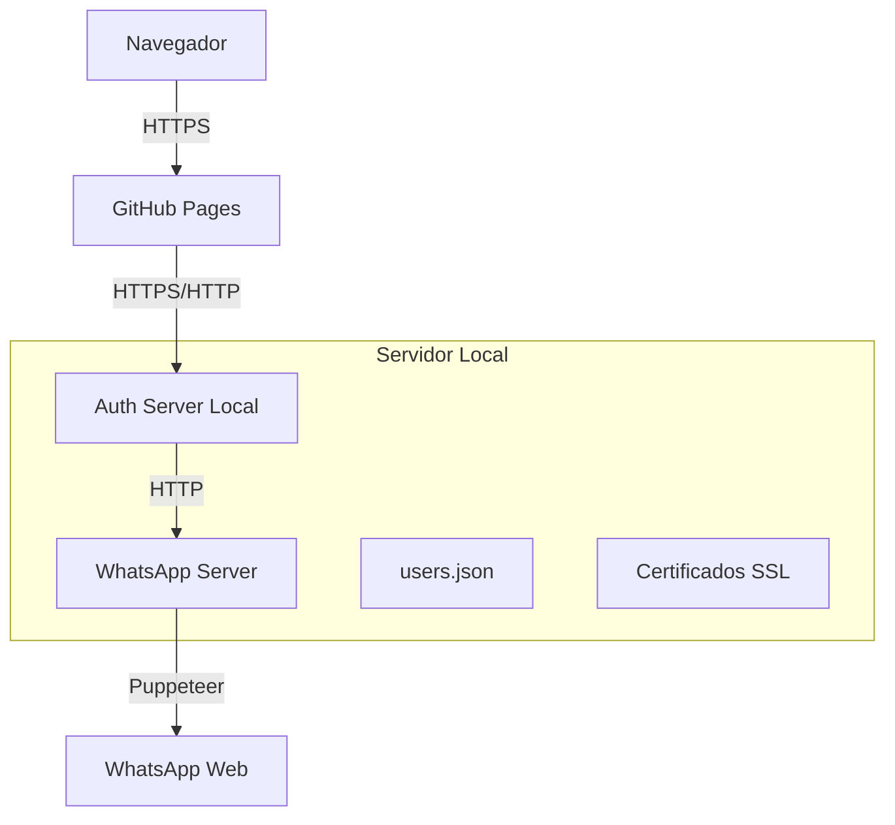
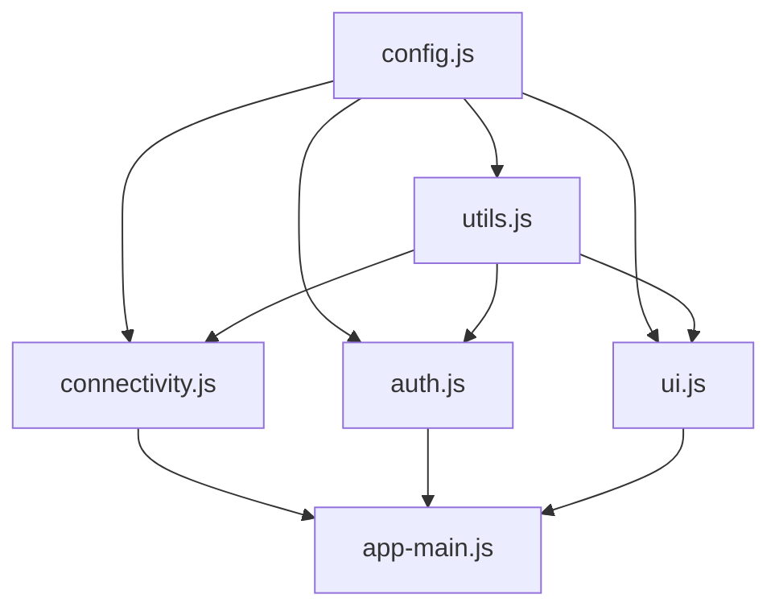

# 📚 Documentação Técnica - WhatIntegra

## 🏗️ Arquitetura do Sistema

### Visão Geral

O WhatIntegra utiliza uma arquitetura distribuída em três camadas:

1. **Interface Web (GitHub Pages)** - Frontend estático
2. **Servidor de Autenticação (Local)** - Gerenciamento de usuários
3. **Servidor WhatsApp (Local)** - Proxy para WhatsApp Web

### Fluxo de Comunicação



## 🔐 Sistema de Autenticação

### Fluxo de Login

1. **Usuário acessa interface** → GitHub Pages carregada
2. **Submissão de credenciais** → Enviadas para servidor local
3. **Validação** → bcrypt compara hash da senha
4. **Geração JWT** → Token assinado com chave local
5. **Armazenamento** → Token salvo em localStorage
6. **Redirecionamento** → Interface WhatsApp exibida

### Estrutura do JWT

```json
{
  "header": {
    "alg": "HS256",
    "typ": "JWT"
  },
  "payload": {
    "username": "Comercial",
    "iat": 1695238923,
    "exp": 1695325323
  },
  "signature": "HMACSHA256(...)"
}
```

## 🌐 API Endpoints

### Servidor de Autenticação (Port 8765/8766)

| Método | Endpoint | Descrição | Autenticação |
|--------|----------|-----------|--------------|
| `GET` | `/` | Health check | Não |
| `POST` | `/api/login` | Autenticação de usuário | Não |
| `GET` | `/api/health` | Status do servidor | Não |
| `POST` | `/api/logout` | Logout do usuário | JWT |
| `GET` | `/api/validate` | Validar token | JWT |

#### POST /api/login

**Request:**
```json
{
  "username": "seuUsuario",
  "password": "suaSenha"
}
```

**Response (Sucesso):**
```json
{
  "success": true,
  "token": "eyJhbGciOiJIUzI1NiIsInR5cCI6IkpXVCJ9...",
  "username": "Comercial"
}
```

**Response (Erro):**
```json
{
  "success": false,
  "error": "Credenciais inválidas"
}
```

### Servidor WhatsApp (Port 3001/3002)

| Método | Endpoint | Descrição | Autenticação |
|--------|----------|-----------|--------------|
| `GET` | `/` | Status do WhatsApp | JWT |
| `GET` | `/qr` | Código QR atual | JWT |
| `GET` | `/chats` | Lista de conversas | JWT |
| `POST` | `/send` | Enviar mensagem | JWT |

## 🔄 WebSocket Events

### Cliente → Servidor

| Event | Dados | Descrição |
|-------|--------|-----------|
| `authenticate` | `{ token }` | Autenticação via JWT |
| `get_qr` | `{}` | Solicita código QR |
| `get_chats` | `{}` | Lista conversas |
| `send_message` | `{ chatId, message }` | Envia mensagem |

### Servidor → Cliente

| Event | Dados | Descrição |
|-------|--------|-----------|
| `authenticated` | `{ success, username }` | Confirmação de auth |
| `qr_code` | `{ qr }` | Novo código QR |
| `whatsapp_ready` | `{}` | WhatsApp conectado |
| `new_message` | `{ from, body, timestamp }` | Nova mensagem |
| `chat_list` | `{ chats }` | Lista de conversas |

## 🛡️ Segurança

### Medidas Implementadas

1. **Hash de Senhas** - bcrypt com salt rounds 12
2. **JWT Seguro** - Tokens assinados com chave local
3. **HTTPS Local** - Certificados SSL auto-assinados
4. **CORS Configurado** - Apenas origens autorizadas
5. **Validação de Input** - Sanitização de dados
6. **Rate Limiting** - Proteção contra ataques de força bruta

### Configuração de CORS

```javascript
const corsOptions = {
  origin: [
    'https://adalbertobi.github.io',
    'http://localhost:8080',
    'http://127.0.0.1:8080'
  ],
  credentials: true,
  optionsSuccessStatus: 200
};
```

## 🔧 Configuração de Ambiente

### Variáveis de Ambiente

```bash
# .env
AUTH_SERVER_PORT=8765
AUTH_SERVER_HTTPS_PORT=8766
WHATSAPP_SERVER_PORT=3001
WHATSAPP_SERVER_HTTPS_PORT=3002
JWT_SECRET=sua_chave_secreta_muito_forte_aqui
BCRYPT_ROUNDS=12
SESSION_TIMEOUT=86400
```

### Estrutura de Dados

#### users.json
```json
{
  "users": [
    {
      "username": "Comercial",
      "password": "$2b$12$hash_da_senha_aqui",
      "created": "2025-09-20T10:00:00.000Z",
      "lastLogin": "2025-09-20T22:30:00.000Z",
      "active": true
    }
  ]
}
```

## 🚀 Deploy e CI/CD

### GitHub Actions Workflow

```yaml
name: Deploy Jekyll with GitHub Pages dependencies preinstalled

on:
  push:
    branches: ["main"]
  workflow_dispatch:

jobs:
  build:
    runs-on: ubuntu-latest
    steps:
      - name: Checkout
        uses: actions/checkout@v4
      - name: Setup Pages
        uses: actions/configure-pages@v5
      - name: Build with Jekyll
        uses: actions/jekyll-build-pages@v1
      - name: Upload artifact
        uses: actions/upload-pages-artifact@v3

  deploy:
    environment:
      name: github-pages
      url: ${{ steps.deployment.outputs.page_url }}
    runs-on: ubuntu-latest
    needs: build
    steps:
      - name: Deploy to GitHub Pages
        uses: actions/deploy-pages@v4
```

## 🧪 Testes e Debugging

### Teste de Conectividade

A função `testConnectivity()` realiza verificações automáticas:

1. **Auth Server** - Verifica se servidor está respondendo
2. **Health Endpoint** - Testa endpoint de saúde
3. **CORS Headers** - Confirma configuração CORS
4. **SSL Certificates** - Valida certificados HTTPS

### Logs de Debug

```javascript
// Configuração de logs
const DEBUG = {
  AUTH: true,
  WEBSOCKET: true,
  WHATSAPP: true,
  NETWORK: true
};

// Exemplo de log
console.log('🔑 === TENTATIVA DE LOGIN ===');
console.log('👤 Usuário:', username);
console.log('🔗 URL de autenticação:', `${API_URL}/login`);
```

## 🔄 Arquitetura Modular

### Estrutura dos Módulos

```
assets/
├── config.js          # Configurações e detecção de ambiente
├── utils.js           # Funções utilitárias compartilhadas
├── connectivity.js    # Testes de conectividade
├── auth.js            # Sistema de autenticação
├── ui.js              # Gerenciamento de interface
└── app-main.js        # Coordenação e inicialização
```

### Dependências entre Módulos



## 📊 Métricas e Monitoramento

### Métricas Coletadas

- **Tentativas de Login** - Sucessos e falhas
- **Tempo de Resposta** - Latência dos endpoints
- **Conexões WebSocket** - Ativas e desconectadas  
- **Mensagens Enviadas** - Volume e frequência
- **Erros de Sistema** - Categorização e frequência

### Health Checks

```javascript
// Endpoint de saúde
GET /api/health
{
  "status": "healthy",
  "uptime": 3600,
  "memory": {
    "used": "45.2 MB",
    "total": "128 MB"
  },
  "connections": {
    "websocket": 3,
    "whatsapp": "connected"
  },
  "timestamp": "2025-09-20T22:30:00.000Z"
}
```